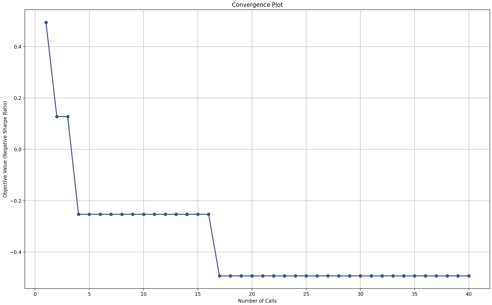
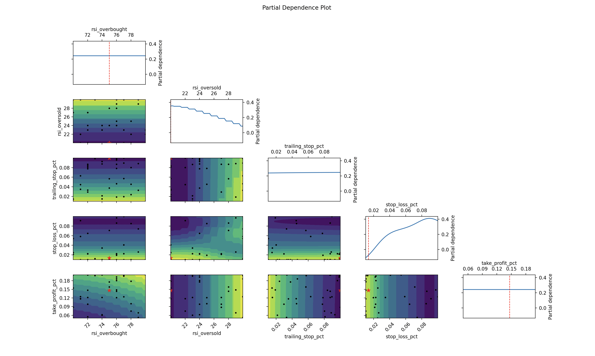

# Financial Mathematics Student

#### Technical Skills: Python, SQL, APIs

## Education
- DePaul University: Bachelor of Science - BS, Financial Mathematics
- Junior (Expected Graduation: May 2026)
- GPA: 3.8

## Projects
### Momentum Trading System

I developed a trading system that uses technical indicators (RSI, Bollinger Bands, MACD) and risk management strategies to find buy and sell opportunities in stock prices. The system uses Python and libraries like Pandas, NumPy, and Plotly for data analysis and visualization.

#### Features
- **Automated Optimization**: Uses Bayesian optimization to tune parameters like stop-loss and take-profit levels for better performance.
- **Risk Management**: Includes trailing stop-loss, maximum drawdown tracking, and win-rate calculations.
- **Performance Metrics**: Evaluates strategies using Sharpe Ratio, cumulative returns, and trade duration.

---

This project helped me learn about trading algorithms, quantitative analysis, and Python-based financial modeling.

---

#### Combined Walk-Forward Analysis
The price chart displays clear **buy** (green triangles) and **sell** (red triangles) signals. The strategy performed well during uptrends while managing risks during drawdowns. This chart shows the strategy’s buy and sell signals plotted against the stock price:


#### Convergence Plot
The convergence plot shows rapid improvements in the first 20 iterations, with the objective stabilizing soon after. This indicates that Bayesian optimization quickly found near-optimal parameters. The plot shows how the objective value (negative Sharpe Ratio) improves with each iteration of the Bayesian optimization process:



#### Partial Dependence Plot
The partial depedence plot shows optimal **RSI levels** at 75 (overbought) and 20 (oversold) align with momentum trading strategies. To add, small stop-loss values and higher take-profit percentages contribute to better risk-reward balance. This visualization highlights how each parameter impacts the system’s performance:



---

#### Results

#### Best Parameters Found
- **RSI Overbought**: 75  
- **RSI Oversold**: 20  
- **Trailing Stop Percentage**: 10%  
- **Stop-Loss Percentage**: 1.35%  
- **Take-Profit Percentage**: 14.64%

#### Performance Metrics
- **Sharpe Ratio**: 0.49  
- **Cumulative Return**: 132.96%  
- **Maximum Drawdown**: 30.49%  
- **Win Rate**: 50.77%  
- **Average Trade Duration**: 18 days, 19 hours, 39 minutes

#### Tools and Libraries Used
- Python (Pandas, NumPy, Plotly)
- Scikit-Optimize (for Bayesian Optimization)
- Matplotlib (for additional plots)

#### How to Run the Project
1. Clone this repository:
   ```bash
   git clone https://github.com/yourusername/momentum-trading-system.git
   
### Project 2
- Description
- 

## Work Experience
**Customer Service @ Abt Electronics (_Aug 2023 - Present_)**
- Server and Administrator | J. Alexander’s Redlands Grill | Mar 2022 - Jun 2023
