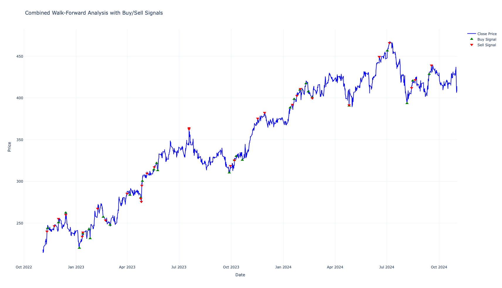
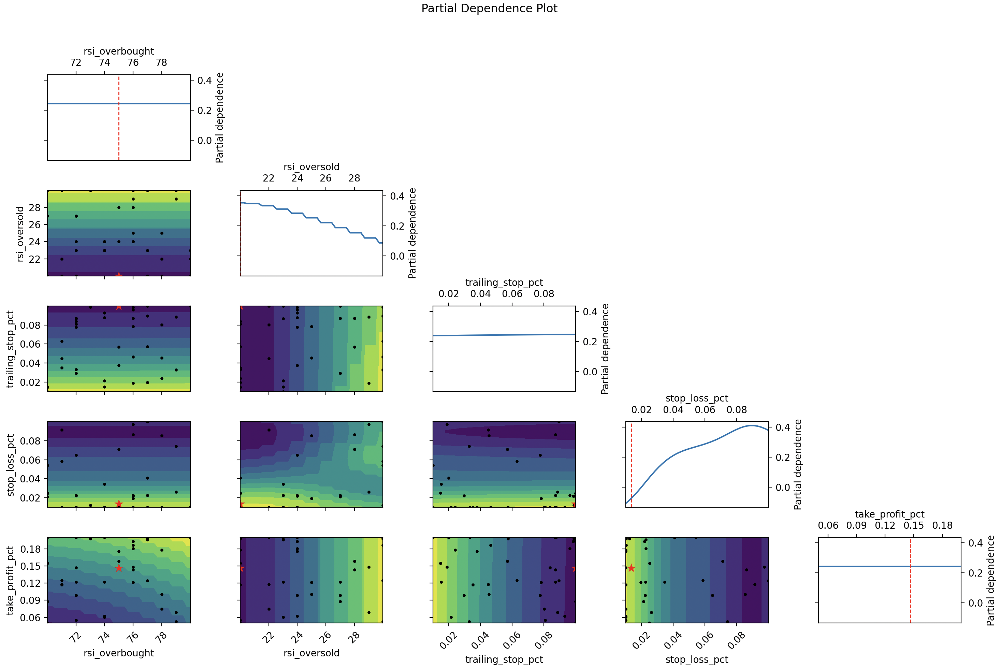

# Financial Mathematics Student

#### Technical Skills: Python, Selenium, NLP, Rest APIs

## Education
- DePaul University: Bachelor of Science - BS, Financial Mathematics
- Junior (Expected Graduation: May 2026)
- GPA: 3.8
- Captain of Quant Team at DePaul's Investment Group (DIG)

## Projects
### Momentum Trading System

I developed a trading system that uses technical indicators (RSI, Bollinger Bands, MACD) and risk management strategies to find buy and sell opportunities in stock prices. The system uses Python and libraries like Pandas, NumPy, and Plotly for data analysis and visualization.

#### Features
- **Automated Optimization**: Uses Bayesian optimization to tune parameters like stop-loss and take-profit levels for better performance.
- **Risk Management**: Includes trailing stop-loss, maximum drawdown tracking, and win-rate calculations.
- **Performance Metrics**: Evaluates strategies using Sharpe Ratio, cumulative returns, and trade duration.

---

This project helped me learn about trading algorithms, quantitative analysis, and Python-based financial modeling.

---

#### Combined Walk-Forward Analysis
The price chart displays clear **buy** (green triangles) and **sell** (red triangles) signals. The strategy performed well during uptrends while managing risks during drawdowns. This chart shows the strategy’s buy and sell signals plotted against the stock price:



#### Convergence Plot
The convergence plot shows rapid improvements in the first 20 iterations, with the objective stabilizing soon after. This indicates that Bayesian optimization quickly found near-optimal parameters. The plot shows how the objective value (negative Sharpe Ratio) improves with each iteration of the Bayesian optimization process:


#### Partial Dependence Plot
The partial dependence plot shows optimal **RSI levels** at 75 (overbought) and 20 (oversold) align with momentum trading strategies. To add, small stop-loss values and higher take-profit percentages contribute to better risk-reward balance. This visualization highlights how each parameter impacts the system’s performance:



---

### Momentum Trading System Results

#### Best Parameters Found
- **RSI Overbought**: 75  
- **RSI Oversold**: 20  
- **Trailing Stop Percentage**: 10%  
- **Stop-Loss Percentage**: 1.35%  
- **Take-Profit Percentage**: 14.64%

#### Performance Metrics
- **Sharpe Ratio**: 0.49  
- **Cumulative Return**: 132.96%  
- **Maximum Drawdown**: 30.49%  
- **Win Rate**: 50.77%  
- **Average Trade Duration**: 18 days, 19 hours, 39 minutes

#### Tools and Libraries Used
- **Python** (Pandas, NumPy, Plotly)
- **Scikit-Optimize** (for Bayesian Optimization)
- **Matplotlib** (for additional plots)

#### How to Run the Project
1. Clone this repository:
   ```bash
   git clone https://github.com/ThomasZaborenko/momentum-trading-system.git

---

### Algorithmic Strategies Dashboard

In this project, I demonstrated my ability to collect, process, and visualize financial data. Using Python, I developed a web scraper to extract detailed statistical summaries of algorithmic trading strategies from the Quantpedia website. I then structured the scraped data into a clean and organized Excel database, ensuring compatibility for advanced analysis. This process required handling dynamic web content with tools like Selenium and BeautifulSoup, managing large datasets, and automating workflows.

Once the data was collected, I utilized Tableau to create an interactive dashboard that highlights key metrics such as risk-adjusted returns, profitability, and capacity across trading strategies. The dashboard includes scatter plots for performance vs. risk analysis, treemaps for strategy capacity, and pie charts for fee distribution. These visualizations allowed me to uncover meaningful insights, such as identifying strategies with optimal risk-return profiles and visualizing how fees impact profitability.

.png)

Through this project, I gained hands-on experience in data scraping, database organization, and interactive data visualization. It deepened my understanding of financial metrics like Sharpe Ratio, Alpha, Beta, and Drawdown, and enhanced my skills in presenting complex quantitative data in an intuitive and visually compelling way. This project not only solidified my technical skills but also showcased my ability to translate raw data into actionable insights for quantitative finance.

---

### Over 100 Projects Created on QuantConnect


